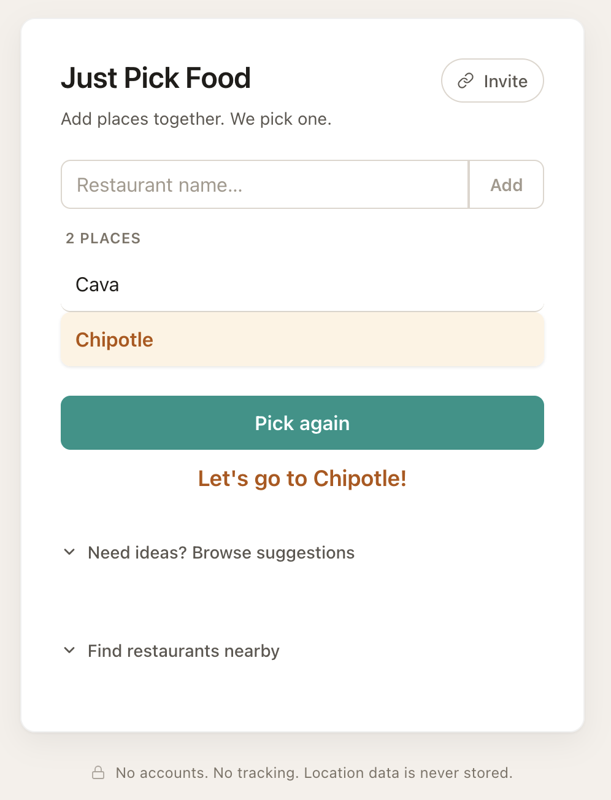

# Just Pick Food

A real-time collaborative food picker. Add places together, share one live room, and let the app choose where to eat.

**Live:** [justpickfood.com](https://justpickfood.com)



---

## How it works

```
Browser A ◀──▶ Firebase Realtime Database ◀──▶ Browser B
   │                                                   │
   └──────────────▶ Cloudflare Worker ◀────────────────┘
                         │
                         ├──▶ Google Maps APIs
                         └──▶ Cloudflare KV (daily request counter)
```

There is no app server for the shared-room workflow. The app is a static React frontend that reads from and writes to Firebase Realtime Database. Firebase also pushes updates back to connected clients over WebSockets — so when one user adds a restaurant, everyone in the same room sees it immediately.

Nearby restaurant search is the one server-side path: the browser calls a Cloudflare Worker, and the Worker calls Google Places or Geocoding with the Google API key kept server-side. The Worker also stores a global daily request counter in Cloudflare KV.

Each session gets a **room ID** generated on first load and stored in the URL (`?room=abc123xyz`). Sharing that URL gives anyone access to the same room.

---

## Project docs

The README is intentionally kept high-level.

- [Getting started](docs/getting-started.md): local setup, commands, and Worker deployment notes
- [Architecture notes](docs/architecture.md): file structure, React app walkthrough, CSS tokens, Firebase data, and Worker proxy details

---

## Cloudflare Worker proxy

Nearby restaurant search routes through a Cloudflare Worker instead of exposing Google API calls directly in the browser. The Worker keeps the Google API key server-side and uses a global daily counter to bound API usage. See [docs/architecture.md](docs/architecture.md#worker-proxy) for implementation details.

---

## Getting started

Setup instructions, local commands, and Worker deployment notes live in [docs/getting-started.md](docs/getting-started.md).

---

## Tech stack

| Layer | Technology | Why |
|---|---|---|
| UI framework | React 18 | Component model, state management |
| Build tool | Vite | Fast dev server, JSX compilation |
| Realtime database | Firebase Realtime Database | Push-based sync across clients with no backend |
| Styling | Plain CSS + custom properties | No build-time dependency, token system gives design consistency |
| API proxy | Cloudflare Workers | Keeps Google API key server-side |
| Usage guard | Cloudflare KV | Stores the daily API usage counter |
| Maps/search | Google Places + Geocoding APIs | Finds nearby restaurants from address or current location |
